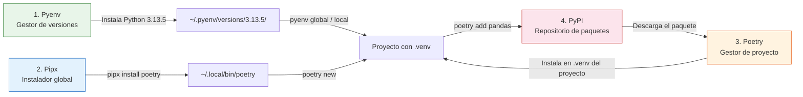

### El Ecosistema Esencial

Este ecosistema es el conjunto de herramientas que elegí para **estandarizar cómo comienzo mis proyectos en Python**. Como uso **Debian**, el criterio central es que ninguna de ellas toque el sistema ni compita con `apt`: cada una opera en un espacio aislado (usuario o proyecto), así evito conflictos de versiones y dependencias.

#### 1. Pyenv — Gestor de versiones de Python

Elegí **pyenv** para instalar y cambiar entre versiones de Python **sin interferir con la versión nativa de Debian**. Al manejarlas desde `~/.pyenv/`, nunca modifico el sistema base, así una actualización de `apt` no puede romper el intérprete de mis proyectos. Cada versión queda como un directorio independiente y lo asigno a toda la sesión o solo al proyecto actual.

```bash
# Instalar una versión
pyenv install 3.13.5

# Usar esa versión como global (para toda la sesión)
pyenv global 3.13.5

# Usar esa versión solo para el proyecto actual
pyenv local 3.13.5
```

**¿Dónde queda?** En `~/.pyenv/versions/3.13.5/`. Cada versión es un directorio independiente.

---

#### 2. Pipx — Instalador de herramientas globales

Elegí **pipx** en lugar de instalar herramientas globales (como Poetry) con `apt`, porque así **evito conflictos de dependencias con el gestor de paquetes del sistema**. pipx instala cada tool en un entorno aislado dentro de `~/.local/bin/`: queda disponible en la terminal pero sin tocar el sistema ni las versiones de Python.

```bash
# Instalar una herramienta global (una sola vez)
pipx install poetry
```

**¿Dónde queda?** En `~/.local/bin/`. No toca el sistema ni las versiones de Python.

---

#### 3. Poetry — Gestor de proyectos "todo en uno"

Elegí **poetry** como estándar para dar forma a mis proyectos. Reemplaza el flujo manual de crear entornos y anotar requerimientos: crea el entorno virtual automáticamente, instala las dependencias y bloquea versiones exactas para reproducibilidad. Como el `.venv` vive **dentro del propio proyecto**, poetry no contamina el sistema: cada proyecto arranca con su propio entorno y sus propias versiones.

```bash
# Crear un nuevo proyecto en el directorio actual

poetry init

# Crear un nuevo proyecto desde un directorio padre (genera .venv automáticamente)
poetry new mi-analisis
cd mi-analisis

# Agregar dependencias (se instalan en el .venv del proyecto)
poetry add pandas
poetry add matplotlib

# Bloquear versiones para reproducibilidad
poetry lock

# Ejecutar dentro del entorno virtual
poetry run python script.py
```

**¿Dónde queda?**
- El `.venv` está **dentro del proyecto** (`mi-analisis/.venv/`), aislado de otros proyectos
- `pyproject.toml` guarda las dependencias
- Cada proyecto tiene su propio `.venv` con sus propias versiones

---

#### 4. PyPI (Python Package Index)

Como **fuente confiable**, tengo en cuenta **PyPI** para el futuro: es el repositorio oficial en la nube y el catálogo central (similar a una "App Store") desde el que Poetry descarga los paquetes. Pensá en PyPI como la referencia de origen que conviene usar, pero sin dogmatizarlo como la única vía posible.

```bash
# Todas las instalaciones de poetry add van aquí
poetry add pandas    # descarga pandas desde PyPI
```

---

#### Diagrama del flujo



---

#### Flujo completo en un proyecto nuevo

```bash
# Paso 1: Elegí la versión de Python
pyenv install 3.13.5
pyenv local 3.13.5

# Paso 2: Creá el proyecto con Poetry (crea .venv automáticamente)
poetry new mi-analisis
cd mi-analisis

# Paso 3: Agregá dependencias
poetry add pandas
poetry add matplotlib

# Paso 4: Usalo
poetry run python script.py
```

**Estructura resultante:**
```
mi-analisis/
├── .venv/                  ← Entorno virtual (aislado en el proyecto)
│   ├── bin/python          ← Python de pyenv dentro del .venv
│   └── lib/
├── pyproject.toml          ← Configuración del proyecto + dependencias
└── poetry.lock             ← Bloqueo de versiones exactas
└── src/
```

**¿Dónde queda el .venv?** Siempre dentro del proyecto, NO en pyenv ni en el sistema. Pyenv gestiona la versión de Python que usa ese `.venv`, pero el entorno virtual es independiente.
