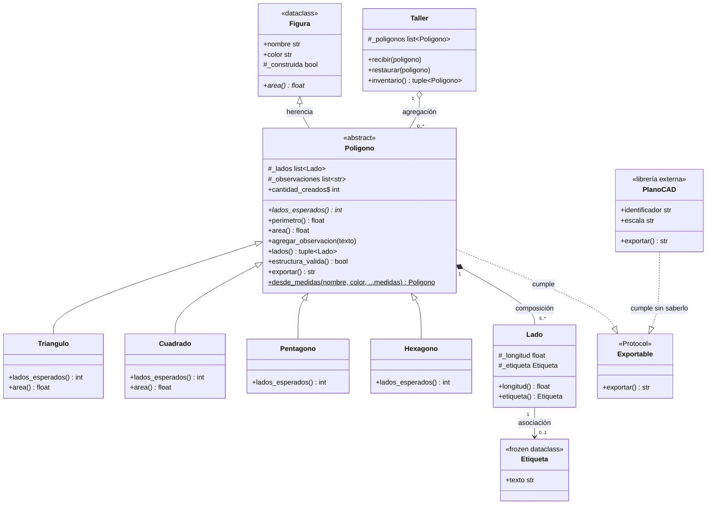

# Modelo Final - Diagrama de Clases

A continuación se detalla el diagrama de clases final del dominio de figuras geométricas, reflejando las decisiones de diseño aplicadas.

## Explicación de Relaciones Estructurales

1. **Herencia (`<|--`):** 
   - `Figura` es la superclase (ABC) de `Poligono`.
   - `Poligono` es la superclase (ABC) de `Triangulo`, `Cuadrado`, `Pentagono` y `Hexagono`. 
   - Esta relación está estrictamente justificada por el dominio: modela un "es-un" absoluto con comportamiento base compartido. *(Corresponde a la **Parte 3 — Herencia justificada por dominio**, ítems 1 y 2, que exige declarar `Poligono` como ABC y crear las subclases faltantes).*

2. **Composición (`*--`):**
   - Un `Poligono` está compuesto por múltiples lados (`Lado`). 
   - **Multiplicidad:** `1` a `3..*`. 
   - La dependencia de vida es fuerte: el polígono exige los lados para construirse y, mediante copia defensiva, controla su existencia; si se destruye el polígono, sus lados se destruyen con él. *(Corresponde a la **Parte 2 — Relaciones estructurales**, donde se indica explícitamente que esta composición "ya está resuelta en el código de partida").*

3. **Agregación (`o--`):**
   - El `Taller` agrupa polígonos (`Poligono`).
   - **Multiplicidad:** `1` a `0..*`. 
   - El taller los recibe ya construidos desde el exterior. Sus ciclos de vida son independientes. *(Corresponde a la **Parte 2 — Relaciones estructurales**, ítem 1 y tabla de multiplicidades, que pide crear la clase `Taller` recibiendo polígonos).*

4. **Asociación (`-->`):**
   - Un `Lado` puede estar asociado a una `Etiqueta`.
   - **Multiplicidad:** `1` a `0..1`. 
   - Es un conocimiento opcional; el lado no requiere de la etiqueta para nacer. *(Corresponde a la **Parte 2 — Relaciones estructurales**, ítem 2 y tabla de multiplicidades, que pide crear la clase inmutable `Etiqueta`).*

5. **Cumplimiento de Protocolo Estructural (`..|>`):**
   - La clase vacía artificial `PoligonoRegular` fue eliminada al tratarse de un "java-ismo". La necesidad de agrupar objetos heterogéneos bajo un mismo contrato se resolvió con el protocolo estructural `Exportable`.
   - Tanto `Poligono` como `PlanoCAD` (la clase externa, a las que se le agregó los cambios, que no estaban en el diagrama inicial) cumplen el contrato de manera implícita mediante *duck typing*, ya que ambas exponen un método `exportar() -> str`. Ninguna hereda nominalmente de `Exportable`. *(Corresponde a la **Parte 4 — ABC vs. Protocol**, que pide reemplazar a `PoligonoRegular` con un protocolo e implementarlo sin forzar la herencia de terceros).*

## Diagrama UML

